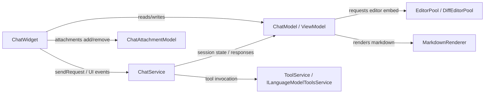
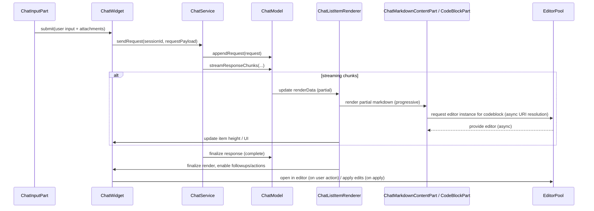

# Chat — Overview

Purpose
- High-level description: interactive assistant/chat UI integrated into the workbench (panel/editor/quick contexts). Supports multi-turn sessions, language-model agents, attachments and tools, progressive streaming responses, and in-place editing of requests and responses.

Key user-facing features
- Multi-turn chat sessions with request/response history, session persistence and checkpoints.
- Progressive streaming-render of responses (partial renders while a model responds).
- Attachments and implicit context: files, images, prompt files, pasted snippets, notebook outputs, SCM history, symbols and toolsets.
- Editor integration: open responses or code blocks in editors, embed inline editors and diff editors for text edits.
- Agent selection and tool invocation (language-model agents, tool sets).
- Accessibility: ARIA labels and custom accessibility services.

High-level architecture
- Components:
  - ChatWidget (UI composition, list + input coordination)
  - ChatViewModel / ChatModel (session state, edits, responses)
  - ChatService (sendRequest, agent orchestration, telemetry)
  - ChatAttachmentModel (attachment lifecycle & resolve)
  - EditorPool / DiffEditorPool / CodeBlockModelCollection (embedded code editors)
  - Markdown renderer + decorations (sanitized chat markdown)
- Diagram (to add): component diagram linking ChatWidget ←→ ChatService ←→ ChatModel ←→ AttachmentModel, and sequence diagram for sendRequest → progressive render → codeblock creation → editor open.

Important source files (representative)
- [`src/vs/workbench/contrib/chat/browser/chatWidget.ts:1`](src/vs/workbench/contrib/chat/browser/chatWidget.ts:1)
- [`src/vs/workbench/contrib/chat/browser/chatViewPane.ts:1`](src/vs/workbench/contrib/chat/browser/chatViewPane.ts:1)
- [`src/vs/workbench/contrib/chat/browser/chatListRenderer.ts:1`](src/vs/workbench/contrib/chat/browser/chatListRenderer.ts:1)
- [`src/vs/workbench/contrib/chat/browser/chatAttachmentWidgets.ts:1`](src/vs/workbench/contrib/chat/browser/chatAttachmentWidgets.ts:1)
- [`src/vs/workbench/contrib/chat/browser/chatAttachmentModel.ts:1`](src/vs/workbench/contrib/chat/browser/chatAttachmentModel.ts:1)
- [`src/vs/workbench/contrib/chat/browser/chatMarkdownRenderer.ts:1`](src/vs/workbench/contrib/chat/browser/chatMarkdownRenderer.ts:1)
- [`src/vs/workbench/contrib/chat/browser/chatContentParts/chatReferencesContentPart.ts:1`](src/vs/workbench/contrib/chat/browser/chatContentParts/chatReferencesContentPart.ts:1)
- Other content parts and pools: ChatMarkdownContentPart, ChatTextEditContentPart, ChatToolInvocationPart, EditorPool, DiffEditorPool

Runtime services & dependencies to reimplement
- IChatService, IChatAgentService, IChatWidgetService, IChatEditingService, IChatWidgetHistoryService
- ILanguageModelsService, ILanguageModelToolsService (toolsets)
- IStorageService / Memento pattern for persistence
- IContextKeyService for feature gating and menus
- IInstantiationService / DI style factory for content parts
- IFileService, IOpenerService, IEditorService, IHoverService, IContextMenuService, Menu/Toolbar integrations

UI primitives & patterns
- Virtualized list/tree: WorkbenchObjectTree / WorkbenchList with supportDynamicHeights and custom delegate/renderer.
- Renderer/delegate pattern: ChatListItemRenderer + ChatListDelegate; ContentPart pattern for renderable pieces (markdown, references, tool invocations, text edits).
- Editor embedding pools to reuse heavy editor instances for code blocks and diffs.
- MenuWorkbenchToolBar and MenuId driven action menus per item.

State, persistence and migration
- Per-session mementos (e.g., `interactive-session-view-<provider>`, `interactive-session-editor-<provider>`) via Memento and IStorageService.
- Attachment and request history persisted via IChatWidgetHistoryService and storage keys: `chat.currentLanguageModel.{location}`, `chat.lastChatMode`, etc.
- Checkpoints and file-change summaries (checkpoints.showFileChanges) persisted in session model.

Progressive rendering / streaming
- Responses support partial render streaming (renderData + contentUpdateTimings).
- Progressive rendering uses word-rate heuristics and debounced intervals; implementation resides in the list renderer and markdown parts.

Attachments & tools
- Attachment model centralizes adding/removing attachments, resolves images via web extractor and file service.
- Widgets: FileAttachmentWidget, ImageAttachmentWidget, PromptFileAttachmentWidget, PasteAttachmentWidget, NotebookCellOutputChatAttachmentWidget, ToolSetOrToolItemAttachmentWidget, SCMHistoryItemAttachmentWidget.
- Drag/drop and context menu integration and resource-context keys for attachment-specific actions.

Accessibility & i18n
- ARIA labels added for attachments, list items and interactive elements.
- ChatAccessibilityService/provider for screen-reader friendly output.
- Localization via nls.js (string keys).

Porting checklist (high-level)
- Recreate DI and lightweight service registry or adapt to target platform.
- Implement virtualized list with dynamic heights and renderer/delegate abstraction.
- Implement safe/sanitized markdown renderer with custom hover handling and allowed tags.
- Rebuild editor pools (embedded editors, diff editors) and codeblock model persistence.
- Recreate attachment resolve pipeline (file, web images), drag/drop and context menus.
- Recreate context key + menu system for per-item actions.
- Ensure telemetry APIs are mapped (event logging, usage metrics).
- Implement persistence/memento semantics and migration paths for keys.

Risks & open questions
- Tight coupling to the VS Code workbench services (context key system, instantiation/DI, theme and icon services).
- Heavy reliance on CodeEditor widgets for embedded code blocks — embedding in a different UI toolkit may require alternate lightweight editors.
- Complex menu/toolbar integration and action wiring bound to MenuId and command service.
- Experiments/entitlements and model selection persistence logic.

Testing & QA
- Unit tests for content parts (markdown rendering, attachments, references list).
- Integration tests for sendRequest lifecycle (progressive stream, pause/resume, cancellation).
- Accessibility tests for ARIA labels and screen-reader navigation.
- Visual regression (snapshot) tests for list rendering and editor embedding.

Files to update after drafting feature docs
- [`product_description/MANIFEST.md:1`](product_description/MANIFEST.md:1)
- [`product_description/OVERVIEW.md:1`](product_description/OVERVIEW.md:1)

Next suggested tasks
- Draft detailed per-feature docs: widget.md, input.md, attachments_and_tools.md, agents_and_prompts.md, editor_integration.md, accessibility_and_a11y.md, testing.md.
- Produce Mermaid diagrams (component and sequence) and add to this overview.
- Perform a file-level call-graph pass for `ChatService` and the content parts.

## Diagrams

Component diagram (high-level)

Sequence diagram (sendRequest → progressive render → codeblock → editor open)

(These diagrams were added to give a compact visual reference for the chat porting plan. See implementation files: [`src/vs/workbench/contrib/chat/browser/chatWidget.ts:1`](src/vs/workbench/contrib/chat/browser/chatWidget.ts:1), [`src/vs/workbench/contrib/chat/browser/chatListRenderer.ts:1`](src/vs/workbench/contrib/chat/browser/chatListRenderer.ts:1), [`src/vs/workbench/contrib/chat/browser/chatAttachmentModel.ts:1`](src/vs/workbench/contrib/chat/browser/chatAttachmentModel.ts:1).)

## File-level notes (new reads)
- [`src/vs/workbench/contrib/chat/browser/chatWidget.ts:1`](src/vs/workbench/contrib/chat/browser/chatWidget.ts:1)
  - Responsibilities: overall UI composition (list + input), view-model wiring, session lifecycle, progressive rendering coordination, editor open handlers, edit/checkpoint workflows, context key bindings and telemetry.
  - Key interactions: instantiates ChatInputPart, ChatListItemRenderer; uses CodeBlockModelCollection and EditorPool via renderer; invokes IChatService.sendRequest and handles response promises (responseCreated/responseComplete).
- [`src/vs/workbench/contrib/chat/browser/chatInputPart.ts:1`](src/vs/workbench/contrib/chat/browser/chatInputPart.ts:1)
  - Responsibilities: input editor widget, attachments UI, followups, toolbar/menu wiring, history, language-model selection, chat-mode switching, implicit-context and related-files contributions.
  - Key interactions: ChatAttachmentModel usage, MenuWorkbenchToolBar menus, CodeEditorWidget for input, history persistence via IChatWidgetHistoryService, selected tools model.
- [`src/vs/workbench/contrib/chat/browser/chatContentParts/chatMarkdownContentPart.ts:1`](src/vs/workbench/contrib/chat/browser/chatContentParts/chatMarkdownContentPart.ts:1)
  - Responsibilities: render chat markdown safely, detect and render code blocks (inline editors or collapsed pills), integrate CodeBlockPart via EditorPool, handle KaTeX/math and markdown decorations.
  - Key interactions: CodeBlockModelCollection updates, uses MarkdownRenderer with sanitizer config (allowedChatMarkdownHtmlTags), constructs codeblock render data and registers height-change events.
- [`src/vs/workbench/contrib/chat/browser/chatContentParts/chatTextEditContentPart.ts:1`](src/vs/workbench/contrib/chat/browser/chatContentParts/chatTextEditContentPart.ts:1)
  - Responsibilities: render text-edit groups as either a summary or as a `CodeCompareBlockPart` (diff view), acquire diff models via a CodeCompareModelService, interact with DiffEditorPool.
  - Key interactions: creates diff view models and wires apply/discard semantics via ChatService/session model state.
- [`src/vs/workbench/contrib/chat/browser/codeBlockPart.ts:1`](src/vs/workbench/contrib/chat/browser/codeBlockPart.ts:1)
  - Responsibilities: heavy editor widget for a single code block (read-only), toolbar/actions, vulnerability annotations, padding/word-wrap/layout nuances, provides a text model content provider for chat editors (Schemas.vscodeChatCodeBlock).
  - Key interactions: CodeEditorWidget creation, toolbar/menu context, communicates with CodeBlockModelCollection for codemapper URIs and streaming updates.

These additions reflect the 5-file deep-dive I completed and provide direct file anchors for future per-file call-graph and porting checklist steps.
