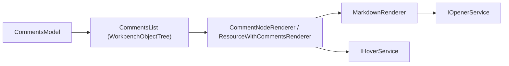

# Feature: Comments — Comments Tree Viewer

Summary
- Short name: Comments Tree Viewer
- Purpose: Show and manage inline code review comments and threads in a tree grouped by resource. Display thread metadata, previews, reply counts, timestamps, and support context actions like reply, resolve, and open in editor.

Representative source files
- Main UI: [`src/vs/workbench/contrib/comments/browser/commentsTreeViewer.ts`](src/vs/workbench/contrib/comments/browser/commentsTreeViewer.ts:1)
- Comments model and controller interfaces: [`src/vs/workbench/contrib/comments/browser/commentsModel.ts`](src/vs/workbench/contrib/comments/browser/commentsModel.ts:1)
- Thread marshalling and common shapes: [`src/vs/workbench/contrib/comments/common/comments.ts`](src/vs/workbench/contrib/comments/common/comments.ts:1)
- Helper components: TimestampWidget (`timestamp.ts`), markdown rendering helpers

Responsibilities
- Render comments grouped by resource with the resource label and per-thread comment entries
- For each thread:
  - Show user name, timestamp, thread state, relevance (outdated), preview text, and range information
  - Show replies metadata: count, last reply summary, and timestamp
- Provide per-thread action bar with context actions (reply, edit, resolve, open in editor)
- Support context menus, keyboard accessibility, and ARIA labels
- Provide filtering and search through comments (via a Filter implementation)

UI and interaction details
- The CommentsList is a WorkbenchObjectTree with two renderer types:
  - ResourceWithCommentsRenderer (resource header rows)
  - CommentNodeRenderer (individual comment threads)
- Thread rendering includes:
  - Markdown-rendered previews with safe link handling (openLinkFromMarkdown)
  - Timestamp widgets for relative timestamps and hover details
  - Action bar populated from menu contributions via CommentsMenus
- Context menu handling uses IMenuService and contextKey overlays to expose thread-specific commands

Data model & behavior
- CommentsModel aggregates ResourceWithCommentThreads and CommentNode objects for display
- CommentNode contains:
  - comment: the original comment (IMarkdownString or string)
  - replies: array of reply entries (each with user/timestamp/body)
  - threadState: resolved/unresolved and applicability flags
  - thread metadata and unique identifiers for marshalling
- Identity provider composes stable ids combining owner, resource, thread id, and comment unique id

Filtering & search
- Filter supports text-based matching across comment bodies, usernames, and replies
- Negation is supported and interacts with parent visibility rules to include/exclude resources appropriately
- Resource-level filters match against resource basename and are applied differently from comment content filters

Services & integrations
- Uses IOpenerService for link handling from markdown content
- Uses IHoverService to provide hover previews for rendered markdown content
- Integrates with IMenuService for context menus and action bar population
- Uses IKeybindingService to surface keybinding labels in action view items

Accessibility & theming
- ARIA labels provided via CommentsList accessibility provider
- The renderer ensures images are replaced or annotated for accessibility
- Thread icons are colored via theme tokens and variables (commentViewThreadStateColorVar)

Persistence & storage
- The viewer relies on controller/working copy or remote comment providers for persistence; the UI itself does not persist comment content
- Thread state changes (e.g., resolve) are performed via comment controller APIs which may persist state externally

Tests & QA
- Unit tests should verify:
  - Rendering logic for comment preview truncation and markdown sanitization
  - Action bar placement and context menu generation for a variety of context key overlays
  - Filter logic across nested replies and negate behavior
- Integration tests should verify:
  - Reply flow, resolve/unresolve, and opening threads in the editor
  - Accessibility labels and keyboard navigation behavior

Porting notes — key points
- Markdown rendering:
  - Uses the base markdown renderer with actionHandler to safely open links; port must provide equivalent sanitized markdown rendering with action hooks
- Timestamp widget:
  - TimestampWidget encapsulates time formatting and hover details; port this widget to preserve consistent timestamp UX
- Context menus & actions:
  - The system relies on context key overlays to scope menu actions; port must support dynamic context overlays for menu queries
- Thread identity & marshalling:
  - The UI uses MarshalledCommentThread structures when passing data to context menus or commands; replicate marshalling or provide equivalent IPC-safe structures

Per-feature porting checklist (see template)
- Required reads:
  - [`src/vs/workbench/contrib/comments/browser/commentsTreeViewer.ts`](src/vs/workbench/contrib/comments/browser/commentsTreeViewer.ts:1)
  - [`src/vs/workbench/contrib/comments/browser/commentsModel.ts`](src/vs/workbench/contrib/comments/browser/commentsModel.ts:1)
  - Comment controller API definitions in `src/vs/workbench/contrib/comments/common/*`
- Steps:
  1. Port markdown renderer hooks and secure link open handling
  2. Implement timestamp widget and hover behaviors
  3. Implement CommentsList tree with resource and comment renderers
  4. Implement filter logic including negation and parent visibility rules
  5. Wire context menus using contextKey overlays and menu service equivalents
  6. Add tests for rendering, filtering, and action flows

TODOs (first pass)
- [ ] Extract complete list of context keys and menu contributions used by comments view
- [ ] Map comment controller APIs and storage behavior for thread state persistence
- [ ] Identify tests under [`test/`](test/:1) that exercise comments flows and add missing test coverage for edge cases
- [ ] Create component diagram for comment rendering flow (renderer -> markdown -> hover -> opener)

Mermaid component sketch

References
- Implementation: [`src/vs/workbench/contrib/comments/browser/commentsTreeViewer.ts`](src/vs/workbench/contrib/comments/browser/commentsTreeViewer.ts:1)
- Model shapes: [`src/vs/workbench/contrib/comments/browser/commentsModel.ts`](src/vs/workbench/contrib/comments/browser/commentsModel.ts:1)
- Thread marshalling: [`src/vs/workbench/contrib/comments/common/comments.ts`](src/vs/workbench/contrib/comments/common/comments.ts:1)
