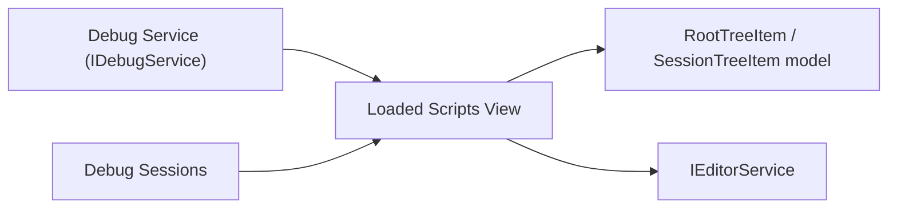

# Feature: Debug — Loaded Scripts View

Summary
- Short name: Loaded Scripts
- Purpose: Show a compressed, navigable tree of scripts/sources loaded by active debug sessions. Allows navigating to sources, grouping by workspace folder/session, filtering, and supports source changes as sessions load/remove scripts.

Representative source files
- Implementation: [`src/vs/workbench/contrib/debug/browser/loadedScriptsView.ts`](src/vs/workbench/contrib/debug/browser/loadedScriptsView.ts:1)
- Debug model & Source objects: [`src/vs/workbench/contrib/debug/common/debugSource.ts`](src/vs/workbench/contrib/debug/common/debugSource.ts:1)
- Debug service interactions: [`src/vs/workbench/contrib/debug/common/debug.ts`](src/vs/workbench/contrib/debug/common/debug.ts:1)

Responsibilities
- Maintain a compressible tree model of loaded source paths per debug session and workspace roots.
- Support path normalization, URL handling, and friendly labels (tildify, workspace-relative paths).
- React to debug session events:
  - onDidLoadedSource (new/changed/removed)
  - onDidNewSession / onDidEndSession
  - onDidChangeName
- Provide filtering by name and expand-all behavior when filtering (preserve view state when clearing filter).
- Open sources in editor when a tree node is opened (uses Source.openInEditor).

UI characteristics
- Uses WorkbenchCompressibleObjectTree for path compression (skips intermediate single-child nodes).
- Renders ResourceLabels for each node with hover titles and matches highlighted.
- When filtering, the view temporarily expands nodes (and preserves previous expanded viewState to restore afterwards).
- Accessibility support via LoadedSciptsAccessibilityProvider with ARIA labels for nodes.

Data model & behavior
- Root tree is RootTreeItem -> SessionTreeItem -> RootFolderTreeItem / BaseTreeItem nodes
- BaseTreeItem keeps a children Map keyed by segment or path and may hold a Source reference for leaves
- SessionTreeItem.addPath splits a path into segments and constructs the tree, mapping absolute paths to folder roots when possible
- When session.getLoadedSources() is supported, the view populates session nodes on startup and updates incrementally

Runtime boundaries & services
- Renderer/UI layer (workbench)
- Depends on:
  - IDebugService for sessions and loaded source events
  - IPathService, IWorkspaceContextService for path handling and workspace folder resolution
  - ILabelService for URI labels
  - IEditorService to open sources
  - ResourceLabels and theme services for icons & styling

Edge cases and notable logic
- URI scheme patterns are detected and displayed properly (e.g., http://host/path)
- Path normalization handles platform specifics (normalizeDriveLetter on Windows, tildify on Unix)
- Single-child compression: nodes with a single child are skipped in presentation unless the node previously had multiple children (to avoid flicker)
- When a source changes with reason 'changed', calls DebugContentProvider.refreshDebugContent(uri) to refresh associated debug content

Persistence & settings
- No persistent storage for view state in this module itself; viewState is captured/restored through tree APIs if needed
- Filtering state is ephemeral and handled by LoadedScriptsFilter

Observability & telemetry
- No direct telemetry emitted by this view in the implementation file; errors or issues logged through standard logging services elsewhere
- Handles costly updates using a RunOnceScheduler to batch refreshes (debounce ~300ms)

Tests & QA
- Unit / integration targets:
  - Verify session add/remove behavior updates the tree model correctly
  - Verify session name changes update labels and viewState refresh
  - Verify path parsing and folder/URL handling for a variety of URIs and absolute/relative paths
  - Verify openInEditor calls with correct range and preserveFocus/pinned options
- Manual QA:
  - Start debug sessions that load many scripts and validate compression behavior
  - Trigger loaded source change events and validate DebugContentProvider refresh behavior

Porting notes
- Virtualized, compressible tree:
  - Port requires a tree control that supports compression (skipping single-child nodes) and provides identity provider semantics that survive reparenting
- Path handling:
  - Preserve platform-aware path normalization and workspace-root-relative labeling behavior
- Session lifecycle:
  - The port must ensure debug session events (loaded sources, name changes, session creation/termination) are available and hooked into the view update lifecycle
- Performance:
  - Maintain batching of refresh operations (RunOnceScheduler) to avoid UI thrashing for rapid source change events

Per-feature porting checklist (see template)
- Immediate reads:
  - [`src/vs/workbench/contrib/debug/browser/loadedScriptsView.ts`](src/vs/workbench/contrib/debug/browser/loadedScriptsView.ts:1)
  - Debug Source model: [`src/vs/workbench/contrib/debug/common/debugSource.ts`](src/vs/workbench/contrib/debug/common/debugSource.ts:1)
  - Debug session interface to understand getLoadedSources() semantics
- High-level steps:
  1. Implement compressible tree or emulate compression in a virtualized tree
  2. Port path normalization helpers and workspace-root mapping
  3. Hook debug session lifecycle events and ensure sources are obtained via session.getLoadedSources()
  4. Implement open-in-editor path -> Source.openInEditor integration
  5. Implement filtering and viewState preservation for expand-on-filter behavior
  6. Add tests and benchmark with large numbers of loaded sources

Mermaid component sketch

References
- Source file: [`src/vs/workbench/contrib/debug/browser/loadedScriptsView.ts`](src/vs/workbench/contrib/debug/browser/loadedScriptsView.ts:1)
- Related helpers: DebugContentProvider, Source model referenced in the implementation
