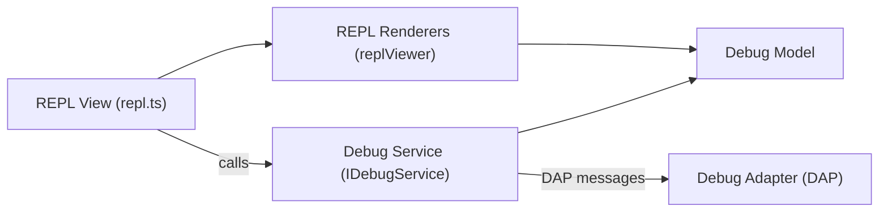

# Feature: Debug Console / REPL

Summary
- Short name: Debug Console (REPL)
- Purpose: Provide a read-eval-print loop and program output pane for debugging sessions. Accepts input, evaluates expressions in the debug session context, renders output (including grouped/structured results), and exposes copy/paste, filtering, and navigation controls.

Where implemented (representative files)
- Primary view implementation: [`src/vs/workbench/contrib/debug/browser/repl.ts`](src/vs/workbench/contrib/debug/browser/repl.ts:1)
- Viewer & renderers: [`src/vs/workbench/contrib/debug/browser/replViewer.ts`](src/vs/workbench/contrib/debug/browser/replViewer.ts:1) (renderers referenced from repl)
- Models & session interfaces: [`src/vs/workbench/contrib/debug/common/replModel.ts`](src/vs/workbench/contrib/debug/common/replModel.ts:1)
- Debug model: [`src/vs/workbench/contrib/debug/common/debugModel.ts`](src/vs/workbench/contrib/debug/common/debugModel.ts:1)
- Actions & icons: [`src/vs/workbench/contrib/debug/browser/debugIcons.ts`](src/vs/workbench/contrib/debug/browser/debugIcons.ts:1), [`src/vs/workbench/contrib/debug/browser/debugActionViewItems.ts`](src/vs/workbench/contrib/debug/browser/debugActionViewItems.ts:1)
- Related editor integration (input editor): [`src/vs/editor/browser/widget/codeEditorWidget.ts`](src/vs/editor/browser/widget/codeEditorWidget.ts:1) (used to host the REPL input)

Responsibilities
- Present debug session output in a scrollable, filterable tree
- Provide an input editor that:
  - Accepts expression text
  - Supports history navigation
  - Offers completions via the debug session (when supported)
  - Persists history and filter values to storage
- Render evaluation results (including groups, nested results, variables, raw objects)
- Integrate with accessibility, theming, and keybindings
- Provide view-level actions (copy all, clear, paste, find/filter, collapse all)
- Maintain per-session scoping (support multi-session REPL view)

Primary runtime boundaries
- Runs in the renderer (workbench) process as a UI view
- Interacts with debug sessions via the debug service (IDebugService)
- Debug expressions are sent to a debug adapter (DAP) through the debug service; evaluation happens in the adapter/process

Core data model (high level)
- REPL contains a set of sessions -> each session exposes an ordered sequence of IReplElement items
- Repl elements include groups (ReplGroup), evaluation inputs, evaluation results, variables, and raw objects
- History is local to workspace and persisted with keys:
  - HISTORY_STORAGE_KEY: `debug.repl.history`
  - FILTER_HISTORY_STORAGE_KEY: `debug.repl.filterHistory`
  - FILTER_VALUE_STORAGE_KEY: `debug.repl.filterValue`
  (see implementation: [`src/vs/workbench/contrib/debug/browser/repl.ts`](src/vs/workbench/contrib/debug/browser/repl.ts:1))

UI flows
- Open REPL view -> tree shows last session output or a chosen session
- Type input -> press Enter -> REPL sends expression to the focused session; input is appended to history and cleared
- Use filter widget to narrow visible tree nodes (supports fuzzy and negation)
- Use Copy/Copy All actions to copy selection or entire visible content (tries to evaluate to clipboard when supported)
- When a session supports completions, REPL registers a completion provider scoped to the REPL input buffer

Public API / extension points (observed)
- Menu and action registration: registers multiple ViewActions and commands such as:
  - `workbench.action.debug.selectRepl`
  - `repl.action.acceptInput`
  - `debug.replPaste`
  - These are defined/registered in the REPL implementation and hooked into the Workbench menu/command system.
- The debug service (IDebugService) and debug model expose session events used by the REPL:
  - onDidFocusSession
  - onDidEvaluateLazyExpression
  - sessions expose onDidChangeReplElements and a method addReplExpression(...)

Persistence and storage
- History and filter state persisted via IStorageService (workspace-scoped, machine target) using keys listed above
- UI layout & theme are governed by ThemeService and view descriptor service for restoring sizes/locations

Observability & telemetry
- The REPL integrates with telemetry for some actions (e.g., publicLog2 events from related debug actions)
- Logging uses ILogService for errors (see implementation where tree input set may be retried with logs on failure)

Tests & QA
- Search test directories for `repl`/`debug` tests (unit/integration/smoke). Representative test harnesses are under [`test/`](test/:1) — map tests to the REPL feature during deeper pass.
- Manual test cases:
  - Enter expression and ensure result appears
  - Evaluate multi-line results and nested groups
  - Completion provider returns suggestions and does not break history navigation
  - Persistence: history and filter survive reloads

Security & privacy notes
- REPL may evaluate code in the debug target — treat any clipboard actions / evaluation outputs carefully
- When using openerService to evaluate links from REPL output, confirm allowCommands flags and security contexts

Porting notes — high level
- UI:
  - The REPL uses the Workbench tree/list infrastructure with renderer components. Porting requires implementing a virtualized tree with dynamic heights, context menus, and accessibility features.
  - The input is a mini code editor widget; port target must choose a compatible editor widget or embed an existing code-editing component with completion support.
- Protocols:
  - REPL relies on the Debug Adapter Protocol (DAP) and the product's debug service; any port must replicate the debug service abstraction to mediate adapter communication.
- State & persistence:
  - Storage keys and usage of IStorageService must be mapped to equivalent persistent storage (per-workspace, per-machine).
- Concurrency:
  - REPL registers completion providers only when focused session supports completions; ensure provider lifecycle and cancellation tokens are mapped correctly.

Per-feature porting checklist (see template)
- Use template: [`product_description/PORTING_CHECKLIST.md`](product_description/PORTING_CHECKLIST.md:1)
- Suggested immediate reads:
  - [`src/vs/workbench/contrib/debug/browser/repl.ts`](src/vs/workbench/contrib/debug/browser/repl.ts:1)
  - [`src/vs/workbench/contrib/debug/browser/replViewer.ts`](src/vs/workbench/contrib/debug/browser/replViewer.ts:1)
  - [`src/vs/workbench/contrib/debug/common/replModel.ts`](src/vs/workbench/contrib/debug/common/replModel.ts:1)
  - Debug service interfaces: [`src/vs/workbench/contrib/debug/common/debug.ts`](src/vs/workbench/contrib/debug/common/debug.ts:1) and [`src/vs/workbench/contrib/debug/common/debugModel.ts`](src/vs/workbench/contrib/debug/common/debugModel.ts:1)

Open questions to resolve in a deeper pass
1. Which exact renderers in `replViewer` map to which DAP response shapes (need to trace ReplEvaluationResult vs variables vs raw objects)?
2. Test coverage mapping — where are unit/functional tests for REPL and what scenarios are missing?
3. Which editor features used by the input require non-trivial porting (snippets, snippet-based selection for completion results)?

Per-feature TODO (first pass)
- [ ] Read and document `replViewer` renderers and mapping to model objects (5-file read batch)
- [ ] Map all storage keys and determine migration strategy
- [ ] Extract all commands and context keys the REPL relies on
- [ ] Identify and list all debug service events used by the REPL
- [ ] Map test files covering REPL and add test migration tasks
- [ ] Produce a component diagram (Mermaid) showing REPL <-> DebugService <-> Debug Adapter and UI components

Mermaid snippet (component view)
- Note: Mermaid code below is plain text in the file; renderers that support Mermaid will visualize it.

References
- Manifest entry and overview: [`product_description/MANIFEST.md`](product_description/MANIFEST.md:1)
- Source-level entrypoints referenced above: [`src/vs/workbench/contrib/debug/browser/repl.ts`](src/vs/workbench/contrib/debug/browser/repl.ts:1)

Next action
- If this document format is acceptable, I will create additional seed feature docs for:
  - Workbench / Open Editors: [`product_description/features/workbench/open_editors.md`](product_description/features/workbench/open_editors.md:1)
  - Extensions / Extension Features Tab: [`product_description/features/extensions/extension_features_tab.md`](product_description/features/extensions/extension_features_tab.md:1)
  - Remote / Remote Explorer & Help: [`product_description/features/remote/remote_explorer.md`](product_description/features/remote/remote_explorer.md:1)
  - Editor / Breadcrumbs Picker: [`product_description/features/editor/breadcrumbs_picker.md`](product_description/features/editor/breadcrumbs_picker.md:1)
  - Comments / Comments Tree Viewer: [`product_description/features/comments/comments_tree.md`](product_description/features/comments/comments_tree.md:1)

Please confirm and I will create the next seed feature files in the same format.
