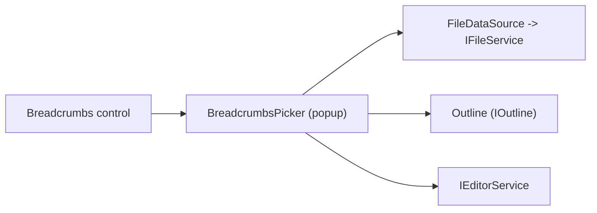

# Feature: Editor — Breadcrumbs Picker

Summary
- Short name: Breadcrumbs Picker
- Purpose: Provide a picker UI used by the breadcrumbs control to let users quickly navigate files and outline symbols. The picker is a popup list/tree that shows file system entries or document outline nodes, supports fuzzy filtering, previewing, and opening the selected item in the editor.

Representative source files
- Picker implementation and control: [`src/vs/workbench/browser/parts/editor/breadcrumbsPicker.ts`](src/vs/workbench/browser/parts/editor/breadcrumbsPicker.ts:1)
- Breadcrumbs model and config: [`src/vs/workbench/browser/parts/editor/breadcrumbs.ts`](src/vs/workbench/browser/parts/editor/breadcrumbs.ts:1)
- Outline & file data sources: [`src/vs/workbench/browser/parts/editor/breadcrumbsModel.ts`](src/vs/workbench/browser/parts/editor/breadcrumbsModel.ts:1)
- UI primitives (lists/trees): [`src/vs/platform/list/browser/listService.ts`](src/vs/platform/list/browser/listService.ts:1)
- Resource labels: [`src/vs/workbench/browser/labels.ts`](src/vs/workbench/browser/labels.ts:1)

Responsibilities
- Show a lightweight popup that lists:
  - Files under a given folder or workspace root (BreadcrumbsFilePicker)
  - Document outline symbols for the active file (BreadcrumbsOutlinePicker)
- Provide:
  - Fuzzy filter and navigation (keyboard & mouse)
  - Preview functionality (outline preview / open on select)
  - Accessibility labels and keyboard navigation support
  - Correct positioning and theming (arrow, width, shadow, border)
- Manage lifecycle: create, layout, set input, dispose; the tree may be a WorkbenchDataTree or WorkbenchAsyncDataTree depending on the content

UI flows and interactions
- User opens file or symbol picker from breadcrumbs UI
- BreadcrumbsPicker constructs its DOM node, positions the arrow, and creates a tree with the appropriate data source
- Typing filters the tree; arrow keys change focused element, Enter opens element in editor (optionally side-by-side)
- Focusing an element can trigger a preview (outline preview); opening fires the underlying editor service to reveal the resource
- Picker cleans up resources on dispose (tree disposal deferred with setTimeout to avoid race conditions)

Data model & services used
- File picker:
  - Uses FileDataSource which resolves filesystem children via `IFileService.resolve(uri)` and returns IFileStat children
  - Uses FileFilter to apply folder-scoped exclude patterns from configuration (BreadcrumbsConfig.FileExcludes)
  - Uses identity provider and FileSorter for stable ordering
- Outline picker:
  - Uses the document's IOutline and configured renderers provided by language/outline services
  - Uses OutlineTreeSorter to apply symbol sort order configured in user settings

Accessibility & theming
- Applies ARIA via list/tree accessibility providers
- Theming uses registered tokens (breadcrumbsPickerBackground, widgetShadow, widgetBorder) and themeService for dynamic colors
- File icon theme changes adjust class names to align icons and twisties; file icon theming is integrated into the tree container

Edge cases & behavior details
- The picker defers tree disposal via setTimeout to avoid disposing while being opened
- File excludes are resolved per-workspace folder; patterns are normalized to absolute paths for matching
- When previewing, resources may call outline.preview() to render a temporary selection; preview disposables are managed per focus change

Porting notes
- Port requires:
  - Virtualized tree/list component supporting async data sources and dynamic heights
  - File system resolution API with directory listing and file stat semantics
  - Configuration & workspace APIs to provide per-folder exclude patterns and dynamic updates
  - Editor service to open resources and support preview flows
  - Theming tokens and a method for applying CSS variables for dynamic colors
- Performance:
  - File listing must be asynchronous and cached where appropriate for smooth UI
  - Filter parsing (glob patterns) must support conversion to a fast matching representation and updates when configuration changes

Per-feature porting checklist (see template)
- Required reads:
  - [`src/vs/workbench/browser/parts/editor/breadcrumbsPicker.ts`](src/vs/workbench/browser/parts/editor/breadcrumbsPicker.ts:1)
  - [`src/vs/workbench/browser/parts/editor/breadcrumbsModel.ts`](src/vs/workbench/browser/parts/editor/breadcrumbsModel.ts:1)
  - File excludes & config binding code in BreadcrumbsConfig
- Steps:
  1. Implement async file resolution API and file stat shape
  2. Implement virtualized tree supporting fuzzy filter and keyboard navigation
  3. Implement preview lifecycle hooks for outline preview
  4. Implement theming tokens and CSS variable propagation for the popup
  5. Add tests validating file excludes, focus/preview behavior, and opening files via picker

Open questions for deeper analysis
- How many languages contribute outline renderers and what assumptions do those renderers make about the WorkbenchDataTree API?
- Are there any platform-specific file system optimizations (like fast directory read caching) to copy or replace?

Mermaid component sketch

References
- Primary code: [`src/vs/workbench/browser/parts/editor/breadcrumbsPicker.ts`](src/vs/workbench/browser/parts/editor/breadcrumbsPicker.ts:1)
- Models: [`src/vs/workbench/browser/parts/editor/breadcrumbsModel.ts`](src/vs/workbench/browser/parts/editor/breadcrumbsModel.ts:1)
