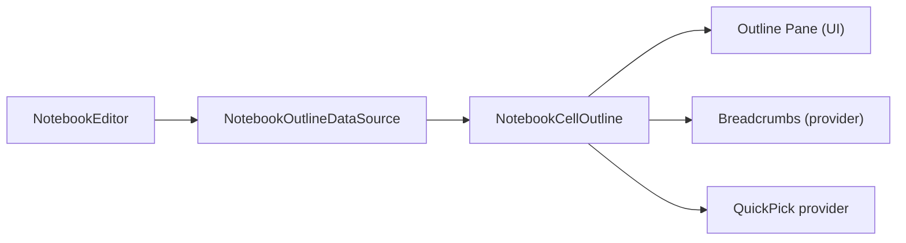

# Feature: Notebook — Outline & Breadcrumbs Integration

Summary
- Short name: Notebook Outline
- Purpose: Provide an outline of notebook cells and their symbols (headers, code-cell symbols), used by the Outline pane, breadcrumbs, and quick-pick flows. Supports filtering (show/hide code cells, symbol levels, markdown header-only), previewing, revealing in editor, toolbar actions per-outline-entry, and configuration-driven behavior.

Representative source files
- Primary implementation and creator: [`src/vs/workbench/contrib/notebook/browser/contrib/outline/notebookOutline.ts`](src/vs/workbench/contrib/notebook/browser/contrib/outline/notebookOutline.ts:1)
- Notebook outline data source / entries: [`src/vs/workbench/contrib/notebook/browser/viewModel/notebookOutlineDataSource.js`](src/vs/workbench/contrib/notebook/browser/viewModel/notebookOutlineDataSource.js:1)
- Outline service & interfaces: [`src/vs/workbench/services/outline/browser/outline.ts`](src/vs/workbench/services/outline/browser/outline.ts:1)
- Notebook editor APIs used (reveal/preview): notebook editor types in [`src/vs/workbench/contrib/notebook/browser/notebookBrowser.ts`](src/vs/workbench/contrib/notebook/browser/notebookBrowser.ts:1)

Responsibilities
- Construct and expose an Outline (IOutline<OutlineEntry>) for notebook editors that:
  - Aggregates markdown headers and code-cell symbols into a tree of OutlineEntry objects.
  - Supports multiple presentation targets:
    - Outline pane (tree with decorations, toolbar actions)
    - Breadcrumbs (small chain of current ancestors)
    - Quick Pick for "Go to symbol"
  - Provides APIs: reveal(entry, options, sideBySide) and preview(entry) to reveal/preview in the notebook editor.
- Maintain view settings and configuration responsiveness:
  - notebook.outline.showMarkdownHeadersOnly
  - notebook.outline.showCodeCells
  - notebook.outline.showCodeCellSymbols
  - notebook.breadcrumbsShowCodeCells
  - notebook.gotoSymbolsAllSymbols
- Listen to and respond to editor and language-provider events:
  - onDidChangeModel, onDidChangeSelection, documentSymbol provider changes
  - Recompute symbols lazily/debounced using Delayer(s)
- Provide action menus for outline entries and per-entry toolbars via MenuService; support context keys to scope menu items.

UI flows and interactions
- Outline pane:
  - Renders OutlineEntry rows (IconLabel + optional problem decoration/badge).
  - Toolbar per-entry with actions contributed by menus (MenuId.NotebookOutlineActionMenu).
  - Supports toggle actions in a ViewTitle submenu (NotebookOutlineFilter) to alter filtering.
- Breadcrumbs:
  - Breadcrumbs use NotebookBreadcrumbsProvider to map current active entry chain into breadcrumb elements.
- Quick Pick:
  - Quick pick collects flat list of outline entries (NotebookQuickPickProvider) and optionally precomputes symbols for fast access.
- Reveal / Preview:
  - reveal(entry, options, sideBySide) opens notebook at the cell + selects/reveals the symbol’s range.
  - preview(entry) scrolls notebook to entry and applies transient decorations; returns a disposable to remove highlight.

Data model & behavior
- OutlineEntry:
  - Contains label, symbol metadata (range, kind), cell reference, marker info, icon, and computed index.
  - Implements flattening or hierarchy for quick-pick and tree views.
- NotebookCellOutline:
  - Manages data sources and view settings, exposes events (onDidChange) and active element computation.
  - Uses NotebookCellOutlineDataSource (instantiated via factory) to compute entries and recompute symbols.
- Configuration-driven filters:
  - NotebookOutlinePaneProvider filters entries based on current configuration flags before presenting them.

Integration points & services used
- IOutlineService (registerOutlineCreator) — notebook registers a creator for NotebookEditor
- IConfigurationService — read & react to notebook settings
- IThemeService — icon theming and color tokens
- IMenuService / MenuWorkbenchToolBar — per-entry toolbar and action registration
- IEditorService — to open editors and reveal resources
- ILanguageFeaturesService.documentSymbolProvider — listens for provider changes to recompute symbols
- INotebookExecutionStateService — to update outline state when execution state changes

Notable implementation details
- Debouncing and scheduling:
  - Uses Delayer for various recompute delays (state, active, and symbol recomputation) to avoid excessive work.
- Quick Pick precompute:
  - When QuickPick target is requested, computeFullSymbols is awaited so quick-pick can list entries synchronously.
- Per-entry problems/decoration:
  - Outline entries track marker info to show badges; Decoration coloring is driven by theme tokens and configuration values for badges/colors.
- Toolbar updates:
  - Menu change events are piped to per-entry toolbars with deferred updates when dropdowns are open to avoid visual glitches.
- Breadcrumbs provider:
  - getBreadcrumbElements returns the parent chain, optionally including/excluding code cells depending on breadcrumbsShowCodeCells config.

Porting notes — high level
- Symbol provider model:
  - Port requires an abstraction for language/document symbol providers and a way to compute and cache symbols per-notebook document.
- Notebook editor APIs:
  - The port must expose editor operations (revealRangeInCenterIfOutsideViewportAsync, deltaCellDecorations, changeModelDecorations, restoreListViewState) or equivalents.
- Toolbars & menus:
  - Recreate menu/tool-bar plumbing and context key overlays to allow contributions to per-entry action menus.
- Performance:
  - Preserve debounced compute strategy and avoid blocking the UI while symbol providers register (use background scheduling).
- Accessibility:
  - Maintain ARIA and keyboard navigation; outline entries are small height (12 in this implementation) and require compact keyboard navigation.

Per-feature porting checklist (see template)
- Required reads:
  - [`src/vs/workbench/contrib/notebook/browser/contrib/outline/notebookOutline.ts`](src/vs/workbench/contrib/notebook/browser/contrib/outline/notebookOutline.ts:1)
  - Notebook outline data source and view-models (notebookOutlineDataSource.js)
  - Outline service and types (IOutline, IOutlineCreator)
  - Notebook editor APIs used for reveal/preview
- Port steps:
  1. Implement Outline API & data source factory for notebook documents
  2. Implement Outline UI renderer with IconLabel, decoration, and per-entry toolbar
  3. Implement QuickPick provider and breadcrumbs provider
  4. Implement reveal & preview integration with the notebook editor control (decorations + scrolling)
  5. Integrate configuration toggles and menu-driven filter actions
  6. Add tests: symbol recompute, reveal/preview lifecycle, config toggles, toolbar actions

Mermaid component diagram (simplified)

References
- Implementation source: [`src/vs/workbench/contrib/notebook/browser/contrib/outline/notebookOutline.ts`](src/vs/workbench/contrib/notebook/browser/contrib/outline/notebookOutline.ts:1)
- Related providers/data sources: NotebookCellOutlineDataSource (in notebook viewmodel folder)
