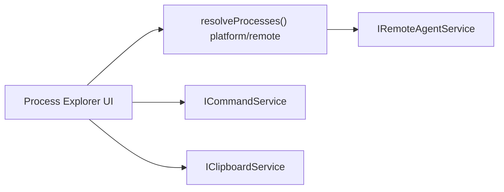

# Feature: Process Explorer

Summary
- Short name: Process Explorer
- Purpose: Visualize processes on local and remote machines, show CPU/memory/PID, support inspect/debug attach, copy rows, and kill/force-kill actions where permitted.

Representative source files
- Control implementation and renderers: [`src/vs/workbench/contrib/processExplorer/browser/processExplorerControl.ts`](src/vs/workbench/contrib/processExplorer/browser/processExplorerControl.ts:1)
- Platform process shapes and resolution: process services and remote diagnostic shapes referenced in same module

Responsibilities
- Provide a tree/list representation of processes grouped by machine/host (supports remote diagnostic errors)
- Render rows with columns: Process name, CPU (%), Memory (MB), PID
- Provide context menu per-process with actions:
  - Kill / Force Kill (when available)
  - Copy / Copy All
  - Debug (attach) when process looks debuggable (heuristics cover node inspect flags and processId)
- Allow keyboard shortcuts (Alt+E to kill selected) and hover details showing command-line
- Continuously refresh process information (delayed polling using Delayer) via resolveProcesses()

Data model & behavior
- Model exposes IProcessTree with processRoots; items may be:
  - IMachineProcessInformation (host-level wrapper)
  - ProcessItem (ProcessItem from base/common/processes)
  - IRemoteDiagnosticError (error info for remote hosts)
- Identity provider maps elements to stable ids (pid, hostName, header)
- Data source provides children for each node and handles single-root vs multiple roots case
- ProcessRenderer uses ProcessExplorerModel.getName(pid, fallback) to map pid -> name (product name for first root, remote-server for others)

UI details
- Tree rows are rendered with small row layout using .row/.cell elements
- Hover shows full command-line via ProcessItemHover (IManagedHover)
- Render indent guides optionally displayed
- Accessibility provider provides ARIA labels ("Process Explorer", per-row labels)

Runtime boundaries & integrations
- Renderer/UI (workbench)
- Uses services:
  - IRemoteAgentService for remote host process info (BrowserProcessExplorerControl.resolveProcesses calls remoteAgentService.getDiagnosticInfo)
  - IClipboardService for copy operations
  - IContextMenuService, ICommandService for actions
  - IProductService for product display name fallback
- Abstract ProcessExplorerControl supports platform-specific implementations by overriding resolveProcesses() and killProcess

Notable logic & heuristics
- Debug attach detection:
  - Patterns DEBUG_FLAGS_PATTERN and DEBUG_PORT_PATTERN are used to detect Node.js inspect flags and derive port or fallback to attaching via PID
  - If debuggable, context menu provides "Debug" action which executes command 'debug.startFromConfig' with appropriate attach config
- Copy behavior:
  - If selection does not include right-clicked item, copy only the right-clicked
  - Copy All copies the entire process-explorer innerText
- Killing:
  - killProcess is abstract and only present when the environment supports it; UI conditionally shows kill actions

Performance & polling
- resolveProcesses() is invoked in a loop using Delayer.trigger() to repeatedly update model and tree
- The control uses model.update and tree.updateChildren to patch the UI efficiently

Tests & QA
- Unit/integration tests should verify:
  - resolveProcesses implementation for each platform (local vs remote) yields expected tree shapes
  - Context menu actions trigger expected commands (kill, copy, debug)
  - Debug detection heuristics for Node inspect flags, ports, and processId fallback
  - Clipboard behavior for Copy and Copy All
- Manual QA:
  - Validate remote host error flows render diagnostic messages
  - Validate attach-to-debug config for Node processes with both --inspect and --inspect-port forms

Porting notes
- Process resolution:
  - Port must provide a reliable process listing API per-platform and remote agent equivalent
- Kill semantics:
  - Implement killProcess(pid, signal) carefully for permissions and platform differences; on some platforms sending SIGTERM/SIGKILL may require elevated privileges
- Debug attach:
  - Preserve Node debugging detection heuristics; map to the target debug subsystem or adapt attach configuration API
- UI:
  - Maintain a virtualized tree capable of dynamic data updates and hover-managed content

Per-feature porting checklist (see template)
- Required reads:
  - [`src/vs/workbench/contrib/processExplorer/browser/processExplorerControl.ts`](src/vs/workbench/contrib/processExplorer/browser/processExplorerControl.ts:1)
  - Platform process types in: `base/common/processes.js`
  - Remote diagnostic types referenced in the same module
- Steps:
  1. Implement process listing/resolution for target platforms (local + remote)
  2. Implement UI tree with renderers and hover support
  3. Implement copy, kill, and attach actions and integrate with command system
  4. Add secure permission checks for killing processes and attaching debuggers
  5. Add tests and run periodic refresh scenarios to ensure stability

Mermaid sketch

References
- Implementation: [`src/vs/workbench/contrib/processExplorer/browser/processExplorerControl.ts`](src/vs/workbench/contrib/processExplorer/browser/processExplorerControl.ts:1)
