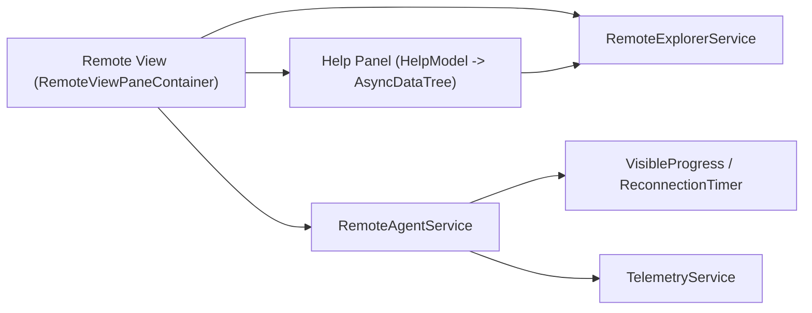

# Feature: Remote — Remote Explorer & Help

Summary
- Short name: Remote Explorer
- Purpose: Provide UI for connecting to and working with remote development targets (SSH, Containers, WSL, remote servers). Surface target types, target-specific views, help/documentation links contributed by extensions, and connection lifecycle feedback (reconnect prompts, progress, error dialogs).

Representative source files
- Main implementation and container: [`src/vs/workbench/contrib/remote/browser/remote.ts`](src/vs/workbench/contrib/remote/browser/remote.ts:1)
- Remote explorer viewlet: [`src/vs/workbench/contrib/remote/browser/remoteExplorer.ts`](src/vs/workbench/contrib/remote/browser/remoteExplorer.ts:1)
- Remote agent / connection services: [`src/vs/workbench/services/remote/common/remoteAgentService.ts`](src/vs/workbench/services/remote/common/remoteAgentService.ts:1)
- Remote explorer service and extension points: [`src/vs/workbench/services/remote/common/remoteExplorerService.ts`](src/vs/workbench/services/remote/common/remoteExplorerService.ts:1)
- UI helpers & view items: [`src/vs/workbench/contrib/remote/browser/explorerViewItems.ts`](src/vs/workbench/contrib/remote/browser/explorerViewItems.ts:1)

Responsibilities
- Provide a FilterViewPaneContainer (viewlet) hosting:
  - Target selector / switcher (SwitchRemoteViewItem)
  - Multiple remote-related views (targets, details, help, etc.)
  - Built-in "Help and feedback" panel that collects extension-contributed help/documentation/issue links
- Maintain and present help information aggregated from extensions via an extension point
- Listen to remote agent connection lifecycle and present progress dialogs, reconnection countdowns, and reload prompts for permanent failures
- Register and manage view container and view descriptors for the remote explorer in the sidebar

Key user interactions & flows
- Selecting a remote target type (SSH, container, WSL, etc.) filters the views available for that target
- Help panel:
  - Aggregates "Get Started", "Documentation", "Issues", and "Report Issue" links contributed by extensions (the extension point is gated by a proposed API check)
  - Clicking a help item may open a URL or invoke a command (walkthroughs are supported)
  - When multiple options are available, QuickPick is used to choose which to open
- Connection lifecycle:
  - On connection loss, show visible progress with options to reconnect now or reload window
  - Display reconnection wait timer and attempt telemetry (publicLog2) for events (ConnectionLost, ReconnectionRunning, PermanentFailure, ConnectionGain)
  - For permanent failures, show an error dialog prompting Reload Window; track if a reload dialog was shown to avoid repeated prompts
- Register view container with ordering and icon; hide if empty using view registry APIs

Data model & services
- HelpInformation: contributed metadata describing extension help links (getStarted, documentation, issues, reportIssue), remoteName, virtualWorkspace
- RemoteView model aggregates HelpInformation instances and exposes onDidChangeHelpInformation
- RemoteAgentService exposes connection and state change events (PersistentConnectionEventType)
- VisibleProgress and ReconnectionTimer classes provide user-facing progress reporting with timers and cancelable buttons

Runtime & architectural boundaries
- Runs in the renderer / workbench process (UI)
- Interacts with:
  - IRemoteAgentService (async remote environment, connection state)
  - IRemoteExplorerService (help information provider and target types)
  - IWorkbenchLayoutService and IViewDescriptorService for view registration and layout
  - IProgressService, IDialogService, and ICommandService to drive progress dialogs and actions
- Telemetry and logging via ITelemetryService and ILogService

Extension points and extension integration
- Remote extensions can contribute help information via a dedicated extension point (value: HelpInformation) — processed only when the proposed API flag 'contribRemoteHelp' is enabled for an extension
- The help information may contain:
  - getStarted, documentation, issues arrays or single values
  - reportIssue: command id or URL
  - remoteName, virtualWorkspace filters to match to environment
- The RemoteView registers a HelpPanel view dynamically when help information exists

Persistence & configuration
- No primary long-term persistence in this module; it relies on services (RemoteExplorerService) to provide data and environmentService.remoteAuthority for current connection context
- Uses the Registry and ViewsRegistry to manage view lifetime, ordering, and hide-if-empty behavior

Observability & telemetry
- Emits telemetry events for remote connection lifecycle (remoteConnectionLost, remoteReconnectionRunning, remoteReconnectionPermanentFailure, remoteConnectionGain, remoteReconnectionReload)
- Uses ITelemetryService.publicLog2 with structured classifications (see implementation)

Security & UX considerations
- Help item URLs may be commands or external links; openerService.open is called with allowCommands: true when appropriate — ensure port preserves safety checks and command tractability
- Extension-contributed values are validated (e.g., parse URI and guard long-running command executions with a timeout when generating URLs)

Performance & reliability
- Avoids blocking UI while resolving help URLs by racing command execution against a short timeout (500ms); caches results
- Uses async data tree for help list rendering to avoid blocking UI for many help items

Porting notes
- View registration:
  - Map the platform's view and menu system (view containers and dynamic views) to an equivalent in the target runtime
- Progress dialogs and timers:
  - Implement a VisibleProgress abstraction for dialog/notification-based progress with buttons and timers; support cancelling and fallback to notifications
- Extension point handling:
  - Implement an extension registry parser for the remote-help extension point; ensure proposed API gating behavior is honored
- Telemetry:
  - Port structured telemetry calls (or map to target telemetry framework) to preserve observability for connection lifecycle

Per-feature porting checklist (see template)
- Immediate reads:
  - [`src/vs/workbench/contrib/remote/browser/remote.ts`](src/vs/workbench/contrib/remote/browser/remote.ts:1)
  - Remote agent & connection: remoteAgentService and remoteAgentConnection types
  - Remote explorer service & extension point definitions
- Steps:
  1. Implement remote agent connection lifecycle events and a connection abstraction that exposes PersistentConnectionEventType
  2. Implement VisibleProgress and ReconnectionTimer behavior in the UI toolkit
  3. Implement help information ingestion and QuickPick-based choice handling
  4. Hook telemetry events into target telemetry or stub for initial port
  5. Add tests for reconnection lifecycle and help rendering

Mermaid component diagram

Open questions for deeper analysis
1. Where is enablement for the 'contribRemoteHelp' extension point documented and how many extensions use it in the bundled `extensions/` folder?
2. What exact persistence (if any) backing the RemoteExplorerService uses for target-type preferences?
3. Are there platform-specific assumptions (native modules or Electron APIs) in reconnection handling that need alternatives in the port?

References
- Implementation: [`src/vs/workbench/contrib/remote/browser/remote.ts`](src/vs/workbench/contrib/remote/browser/remote.ts:1)
- View registration and container: same file and related `remoteExplorer.ts` implementation
