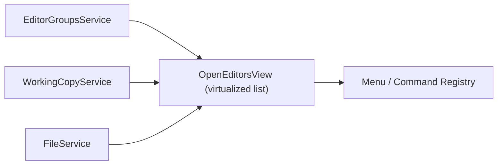

# Feature: Workbench — Open Editors

Summary
- Short name: Open Editors
- Purpose: Show and manage the list of currently open editors across editor groups. Provides grouping, sorting, drag-and-drop reordering, context menus, actions (save, close, new untitled), and visual indicators for dirty/readonly/sticky editors.

Representative source files
- Main view implementation: [`src/vs/workbench/contrib/files/browser/views/openEditorsView.ts`](src/vs/workbench/contrib/files/browser/views/openEditorsView.ts:1)
- Editor list rendering and models referenced inside the file (supporting types):
  - [`src/vs/workbench/common/editor/editorInput.ts`](src/vs/workbench/common/editor/editorInput.ts:1) (editor model)
  - Files and label helpers: [`src/vs/workbench/browser/labels.ts`](src/vs/workbench/browser/labels.ts:1)
- Drag & drop helpers: [`src/vs/workbench/browser/dnd.ts`](src/vs/workbench/browser/dnd.ts:1)
- Actions referenced (examples):
  - Save / Close actions: [`src/vs/workbench/contrib/files/browser/fileActions.ts`](src/vs/workbench/contrib/files/browser/fileActions.ts:1)
  - Editor actions: [`src/vs/workbench/browser/parts/editor/editorActions.ts`](src/vs/workbench/browser/parts/editor/editorActions.ts:1)

Responsibilities
- Maintain a view that lists open editors in the current workspace, with optional grouping by editor group.
- Provide sorting options:
  - editorOrder (Group order)
  - alphabetical
  - fullPath
- Provide drag-and-drop reordering when in editorOrder sort mode.
- Support interactions:
  - Click to open editor (single/multi-click behavior, side-by-side)
  - Middle-click to close an editor
  - Context menu with file- and editor-level commands
  - Keyboard navigation and accessibility
- Display editor metadata and visual states:
  - Dirty indicator
  - Preview (italic / preview mode)
  - Sticky/pinned editors
  - File decorations (badges, colors)
  - Extra label classes and icons

UI and UX details
- Layout:
  - The view is a Workbench List (virtualized) hosted in a ViewPane; it uses a custom delegate and renderer combination to render editor groups and open editor entries.
  - When multiple editor groups exist, the view inserts group rows (EditorGroupRenderer). Otherwise the view lists editors directly.
- Actions:
  - Per-row action bar shows Close or Unpin depending on editor state.
  - View title actions include Toggle Layout, Save All, Close All, New Untitled, etc. (registered via registerAction2)
- Accessibility:
  - ARIA labels and list-level accessibility provider are provided.
  - Keyboard bindings are mapped to open, focus, and group actions.

Core data model and behavior
- Elements displayed in the list are either:
  - IEditorGroup (a group header representing an editor group)
  - OpenEditor (wrapper around EditorInput + group reference)
- The view subscribes to IEditorGroupsService to receive updates about group model changes:
  - Editor open/close/move/active/dirtiness/sticky/capabilities changes
- The list maintains identityProvider and uses element.getId or group.id for stable identity.
- Dirty indicator:
  - Uses IWorkingCopyService to track dirty count and update a badge on the view title area.

Runtime boundaries & dependencies
- Renderer/workbench UI only (front-end).
- Interfaces relied on:
  - IEditorGroupsService (editor group model)
  - IWorkingCopyService (dirty management)
  - IFileService (for file provider checks)
  - ICommandService and IContextMenuService (actions & menus)
- Integrations:
  - Decorations come from file decoration settings and File Decorations services.
  - Drag-and-drop uses Workbench DnD and supports both internal reorder and dropping files to open them.

Persistence & configuration
- Configuration options affecting the view:
  - explorer.openEditors.sortOrder
  - explorer.openEditors.visible
  - explorer.openEditors.minVisible
  - explorer.decorations.* (affecting visuals)
- Layout sizing is controlled by view descriptor and `minimumBodySize` / `maximumBodySize` logic.

Performance considerations
- Uses a virtualized WorkbenchList to support large numbers of editors.
- Debounces list updates using a RunOnceScheduler (structuralRefreshDelay) to avoid excessive re-renders on rapid group model changes.
- Sorting modes that are not editorOrder disable reordering to avoid complex reorder logic.

Public API surfaces (observed)
- Commands registered by the view:
  - `workbench.action.toggleEditorGroupLayout` (flip layout)
  - `workbench.action.files.saveAll` (Save All)
  - Other `openEditors.*` commands for New Untitled, Close All etc.
- Context keys used:
  - OpenEditorsFocusedContext, ExplorerFocusedContext, OpenEditorsGroupContext, OpenEditorsSelectedFileOrUntitledContext, OpenEditorsDirtyEditorContext, OpenEditorsReadonlyEditorContext
- The view interacts with the menu registry (MenuId.ViewTitle, MenuId.OpenEditorsContext)

Tests & QA mapping
- The view logic should have unit and integration tests in `test/` that validate:
  - Proper list updates on group model changes
  - Correct drag-and-drop behavior for reordering and file drops
  - Action availability conditioned on context keys
  - Dirty counter update logic with WorkingCopyService
- Add smoke tests that involve opening/closing editors and verifying UI reflects changes.

Porting notes — key points
- Virtualized UI:
  - Porting requires an efficient virtualized list and editable renderer pipeline that supports group rows and per-row action bars.
- Drag-and-drop:
  - The drag-and-drop has nuanced behavior (top/bottom/center sectors, cross-group moves). Port must reproduce drop target detection and index adjustments (careful about index shifts when moving within same group).
- Identity & stability:
  - Ensure stable identity provider semantics for elements to avoid visual flicker during updates.
- Context keys & menus:
  - Context key system and menu registration need equivalents (or a mapping layer) in the target platform to preserve contextual actions.
- Services:
  - IEditorGroupsService and IWorkingCopyService behavior must be replicated or adapted to the new runtime.

Per-feature porting checklist (see template)
- Required reads:
  - [`src/vs/workbench/contrib/files/browser/views/openEditorsView.ts`](src/vs/workbench/contrib/files/browser/views/openEditorsView.ts:1)
  - Related editor/group services: [`src/vs/workbench/services/editor/common/editorGroupsService.ts`](src/vs/workbench/services/editor/common/editorGroupsService.ts:1)
  - Working copy and file services referenced in the file
- High-level steps:
  1. Implement a virtualized list component with templates for group rows and editor rows.
  2. Implement identity provider and diff/replace semantics to minimize UI churn.
  3. Recreate drag-and-drop behavior with sector detection and reordering semantics.
  4. Wire context menu and view title actions using the target platform's menu/command system.
  5. Implement dirty badge and integrate with working-copy-like service for tracking unsaved state.
  6. Add tests and run smoke tests.

TODOs (first pass)
- [ ] Extract every action and menu contribution that affects the Open Editors view.
- [ ] Map all configuration keys used by the view and their defaults.
- [ ] Produce a sequence diagram showing reorder logic when dragging across groups (Mermaid).
- [ ] Locate and map existing tests covering Open Editors; create missing tests for reordering edge-cases.
- [ ] Capture CSS and theming tokens used by the view for porting the UI styles.

Mermaid component diagram (simple)

References
- Primary implementation: [`src/vs/workbench/contrib/files/browser/views/openEditorsView.ts`](src/vs/workbench/contrib/files/browser/views/openEditorsView.ts:1)
- Related code and action registrations shown inline in the source file.

Next steps
- I will continue creating feature docs for:
  - Extensions — Extension Features Tab: [`product_description/features/extensions/extension_features_tab.md`](product_description/features/extensions/extension_features_tab.md:1)
  - Remote — Remote Explorer & Help: [`product_description/features/remote/remote_explorer.md`](product_description/features/remote/remote_explorer.md:1)
  - Editor — Breadcrumbs Picker: [`product_description/features/editor/breadcrumbs_picker.md`](product_description/features/editor/breadcrumbs_picker.md:1)
  - Comments — Comments Tree Viewer: [`product_description/features/comments/comments_tree.md`](product_description/features/comments/comments_tree.md:1)

I will proceed to create the next feature document now.
